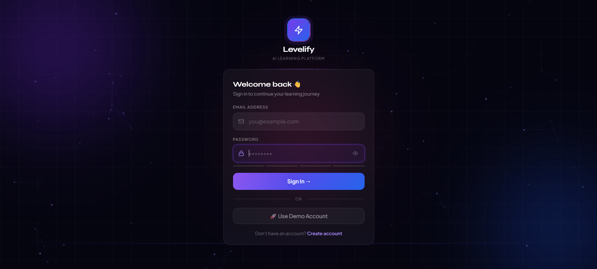
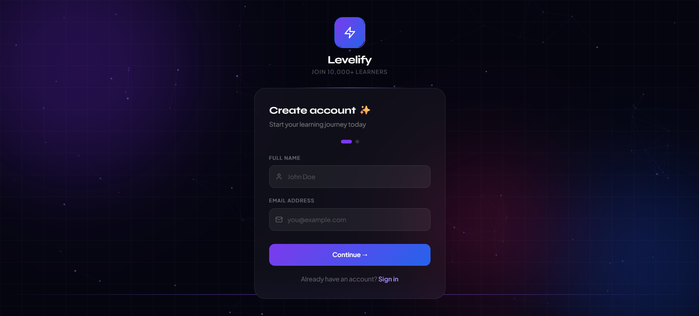
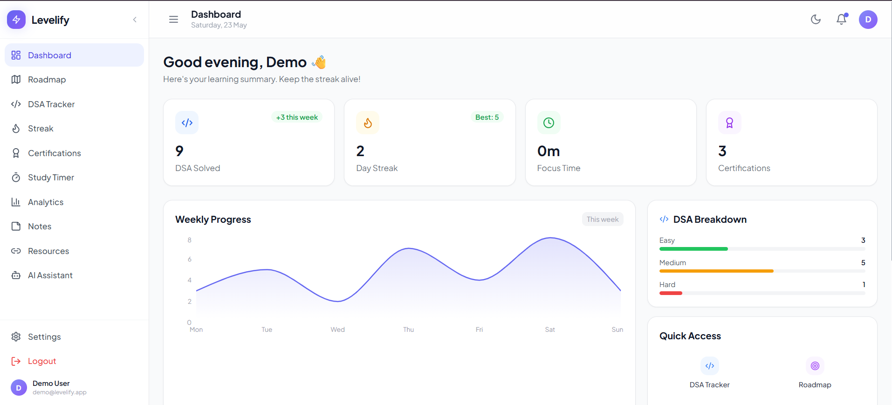
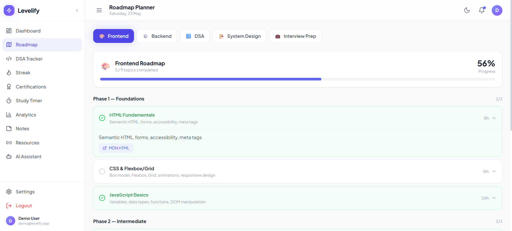
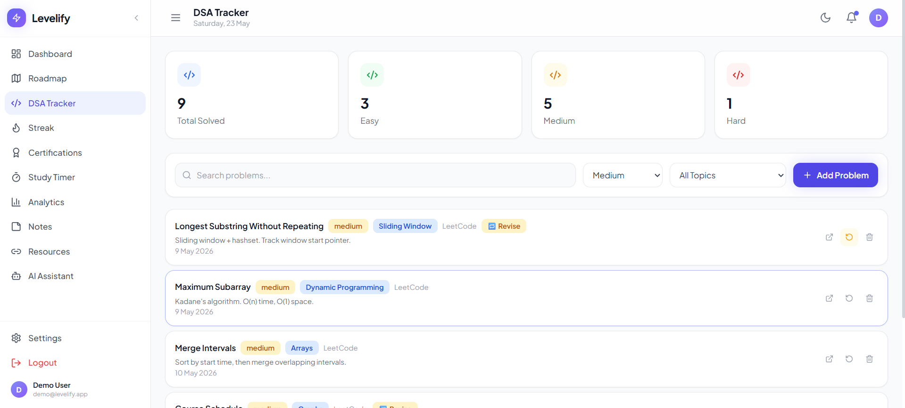
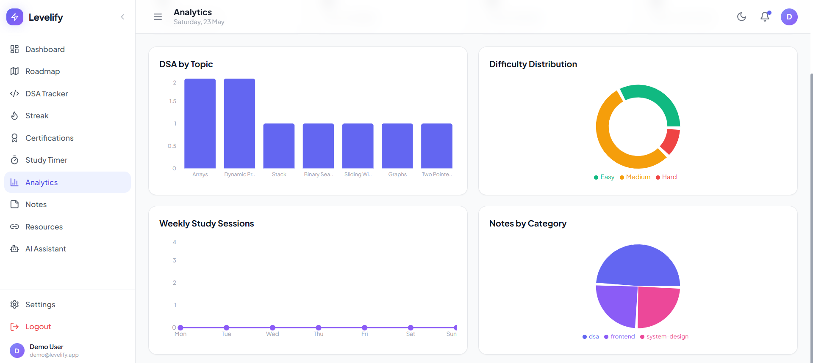
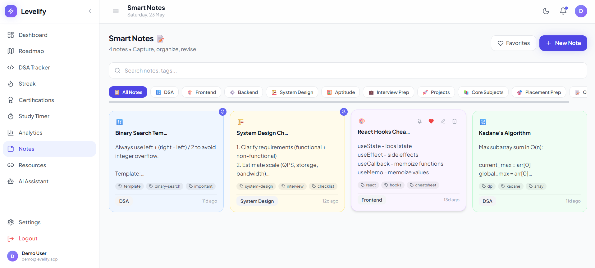
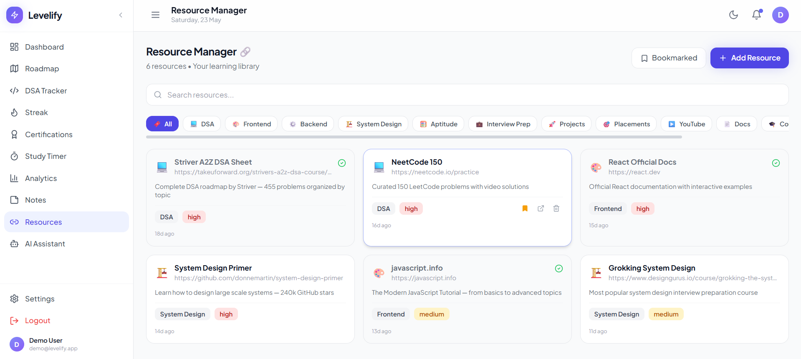
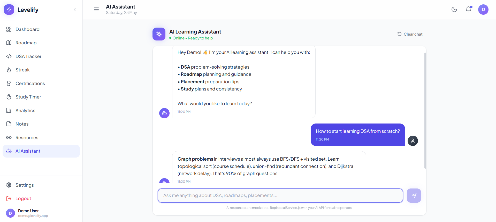

<p align="center">
  
  
  
  
  
</p>


# 🚀 Levelify - Learn Better, Grow Smarter.

<p align="center">
  <strong>AI-Powered Learning & Career Growth Platform</strong><br/>
  A modern productivity & learning ecosystem built to help students and developers track progress, master DSA, organize resources, improve consistency, and grow with AI-powered guidance.
</p>

<p align="center">


</p>

---
## 🌐 Live Demo

🔗 **Live Website:**  
https://levelify.vercel.app/

📂 **GitHub Repository:**  
https://github.com/rajmanvi17/Levelify

---

# ✨ About Levelify

**Levelify** is an AI-powered smart learning and career growth platform designed to help students and developers stay consistent, organized, and placement-ready.

Instead of managing learning across multiple platforms, Levelify combines:

- 📚 Learning Roadmaps
- 💻 DSA Tracking
- 🔥 Coding Streaks
- 📝 Smart Notes
- 🔗 Resource Management
- 📈 Analytics
- 🏆 Certification Tracking
- 🤖 AI Learning Assistant

all in one seamless and beautiful experience.

The platform is built with a **modern SaaS-inspired UI**, smooth interactions, glassmorphism design, and scalable frontend architecture.

---

## 📱 Features (10 Modules)

| Module | Description |
|---|---|
| 🏠 **Dashboard** | Stats overview, DSA breakdown, weekly progress chart, quick access |
| 🗺️ **Roadmap Planner** | 5 roadmaps (Frontend, Backend, DSA, System Design, Interview Prep) with progress tracking |
| 💻 **DSA Tracker** | Log solved problems, filter by difficulty/topic, mark for revision |
| 🔥 **Streak Tracker** | GitHub-style heatmap, current & longest streak |
| 🏆 **Certifications** | Track certifications, progress bars, deadline management |
| ⏱️ **Study Timer** | Pomodoro, Deep Work, Break modes with session history |
| 📈 **Analytics** | Recharts-powered charts — DSA topics, difficulty, weekly sessions |
| 📝 **Smart Notes** | Glassmorphism note cards, pin, favorite, tags, color-coded categories |
| 🔗 **Resource Manager** | Save & organize learning links by category, bookmark, mark visited |
| 🤖 **AI Assistant** | Chat-based learning guidance with smart mock responses |
---

# 🖼️ Screenshots

## 🔐 Login Page



---

## 📝 Register Page



---

## 🏠 Dashboard



---

## 🗺️ Roadmap Planner



---

## 💻 DSA Tracker



---

## 📈 Analytics Dashboard



---

## 📝 Smart Notes



---

## 🔗 Resource Manager



---

## 🤖 AI Assistant



---

## 🚀 Quick Start

```bash
# 1. Install dependencies
npm install

# 2. Start development server
npm run dev

# 3. Open http://localhost:5173

# Demo credentials
Email:    demo@levelify.app
Password: demo123
```

## 📦 Build & Deploy

```bash
# Build for production
npm run build

# Preview production build locally
npm run preview

# Deploy to Vercel
npx vercel --prod
```

---
# 📁 Project Structure

```bash
Levelify/
│── dist/
│── node_modules/
│── public/
│
│── screenshots/
│
│── src/
│   ├── assets/
│   │
│   ├── components/
│   │   ├── layout/
│   │   └── ui/
│   │
│   ├── pages/
│   │   ├── LoginPage.jsx
│   │   ├── RegisterPage.jsx
│   │   ├── DashboardPage.jsx
│   │   ├── RoadmapPage.jsx
│   │   ├── DSATrackerPage.jsx
│   │   ├── AnalyticsPage.jsx
│   │   ├── NotesPage.jsx
│   │   ├── ResourcesPage.jsx
│   │   └── AIAssistantPage.jsx
│   │
│   ├── services/
│   ├── hooks/
│   ├── store/
│   ├── routes/
│   ├── constants/
│   ├── data/
│   ├── utils/
│   │
│   ├── App.jsx
│   └── main.jsx
│
│── README.md
│── package.json
│── vite.config.js
│── vercel.json
```

---

## 🎨 Design System

- **Font**: Plus Jakarta Sans (headings/body) + JetBrains Mono (code)
- **Colors**: Primary indigo/violet scale + semantic colors
- **Dark mode**: Tailwind `dark:` prefix, toggled via class on `<html>`
- **Glass cards**: `bg-white/70 dark:bg-white/5 backdrop-blur-md`
- **Animations**: Framer Motion — page transitions, stagger, hover lifts

---

## ⚡ Performance

- All pages lazy-loaded with `React.lazy()`
- Zustand selector subscriptions (no wasted renders)
- `useDebounce(400ms)` on all search inputs
- `useMemo` on filtered/sorted lists
- Tailwind CSS purging — only used classes in bundle
- Target bundle: **< 200KB** initial JS (gzipped)
- Manual chunk splitting: react-vendor | motion | charts | store

---

## 🔌 Backend Integration Checklist

When handing off to backend developer, implement these endpoints:

| Service | Endpoints |
|---|---|
| Auth | `POST /auth/login` `POST /auth/register` `GET /auth/me` `POST /auth/logout` |
| DSA | `GET/POST/PUT/DELETE /dsa/problems` |
| Roadmap | `GET /roadmaps` `PUT /roadmaps/:id/node/:nodeId` |
| Notes | `GET/POST/PUT/DELETE /notes` |
| Resources | `GET/POST/PUT/DELETE /resources` |
| Certs | `GET/POST/PUT/DELETE /certifications` |
| Streak | `GET /streak` `POST /streak/log` |
| Timer | `POST /sessions` `GET /sessions/analytics` |
| AI | `POST /ai/chat` `GET /ai/suggestions` |

---

## 🚢 Vercel Deployment

1. Push to GitHub
2. Import project in Vercel
3. Framework preset: **Vite**
4. Build command: `npm run build`
5. Output directory: `dist`

The `vercel.json` in the root handles SPA routing automatically.

---

## 🛠️ Tech Stack

| Package | Version | Purpose |
|---|---|---|
| react | 18.x | UI framework |
| vite | 5.x | Build tool |
| tailwindcss | 3.x | Styling |
| framer-motion | 11.x | Animations |
| zustand | 4.x | State management |
| react-router-dom | 6.x | Routing |
| recharts | 2.x | Charts |
| lucide-react | 0.344 | Icons |
| date-fns | 3.x | Date utilities |
| sonner | 1.x | Toast notifications |
| react-hook-form | 7.x | Form handling |

---

# 🔮 Future Improvements

| Future Feature | Description |
|----------------|-------------|
| 🎙️ Voice Learning Assistant | Audio guidance for study & productivity |
| 📰 Tech & Placement News | Latest placement, hiring & technology news |
| 🤝 Collaboration Features | Study groups & peer learning |
| 🧠 Smarter AI Assistant | Personalized roadmap recommendations |
| 📅 Smart Scheduling | AI-powered study planning |
| 📊 Advanced Analytics | Better productivity & learning insights |

---

# 🤝 Contributing

Contributions, suggestions, and ideas are welcome.

If you'd like to contribute:

### 1. Fork repository

### 2. Create branch

```bash
git checkout -b feature-name
```

### 3. Commit changes

```bash
git commit -m "Added new feature"
```

### 4. Push branch

```bash
git push origin feature-name
```

### 5. Open Pull Request 🚀

---

# 👩‍💻 Author

### **Manvi Raj**

Passionate about building smart, scalable, and impactful digital experiences through modern frontend development.

---

## 🌐 Let's Connect

💼 **LinkedIn**  
https://www.linkedin.com/in/manvi-raj-593747274

✍️ **Medium**  
https://medium.com/@manvi.raj60

🔗 **GitHub**  
https://github.com/rajmanvi17

🌍 **Live Project**  
https://levelify.vercel.app/

💡 Open to collaboration, frontend opportunities, and impactful projects.

---

# ⭐ Feedback & Support

If you found **Levelify** useful:

⭐ Star the repository  
📝 Share feedback or suggestions  
🐛 Report bugs or improvements via issues

Your support helps improve the project.

---
# 🤝 Contributing

We welcome contributions from everyone.

If you're new to open source, check our issues labeled:

- good first issue
- documentation
- enhancement

Fork the repository and submit a Pull Request.

Happy Coding ❤️

<p align="center">
Built with 🩵 by <strong>Manvi Raj</strong>
</p>


